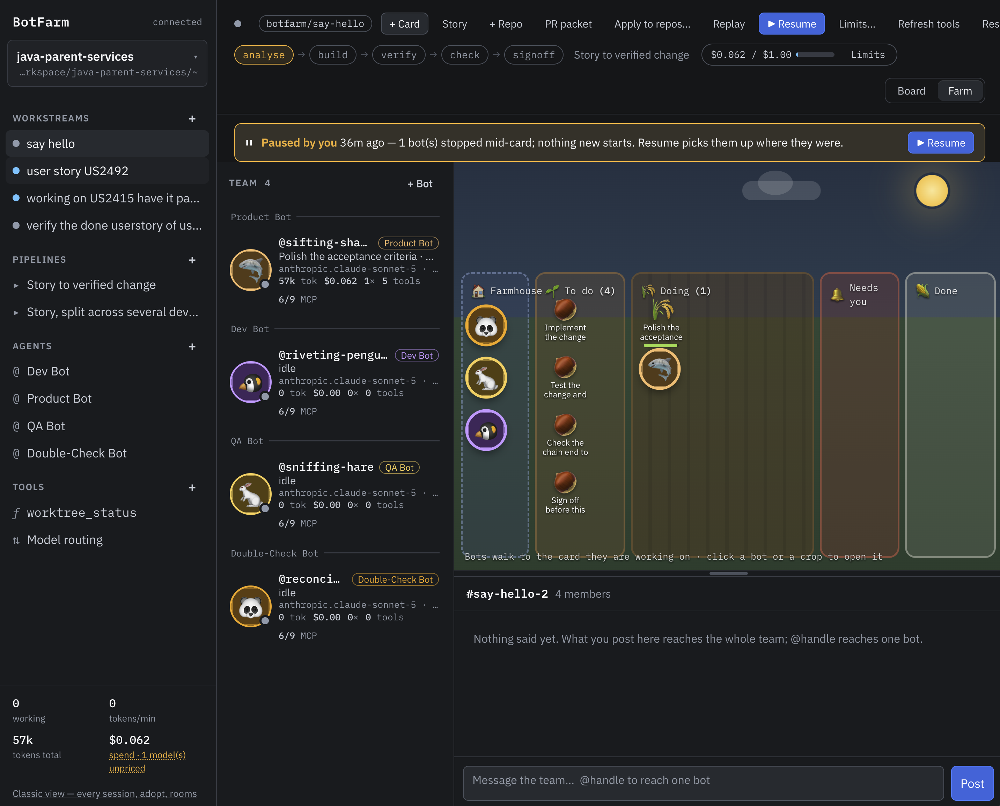
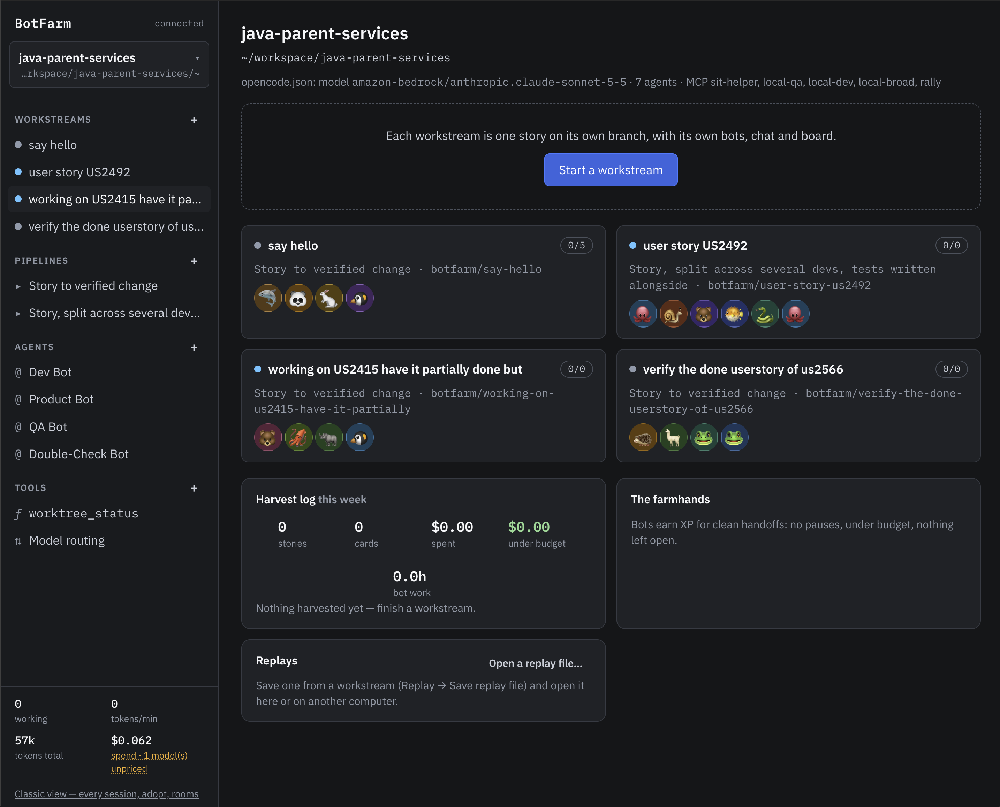
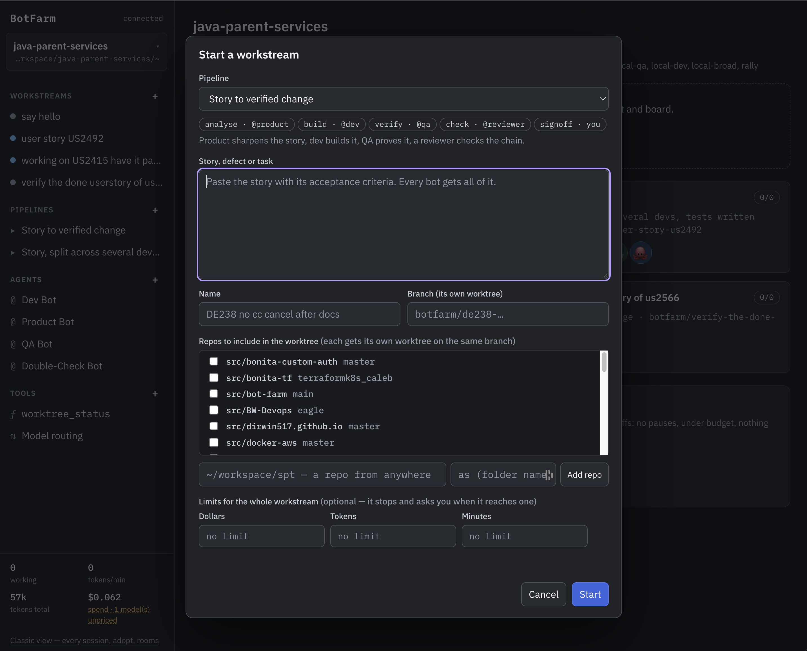
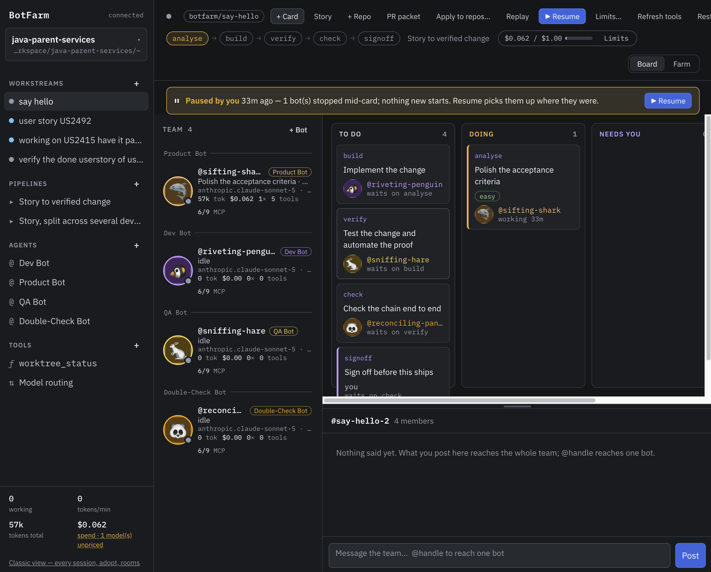
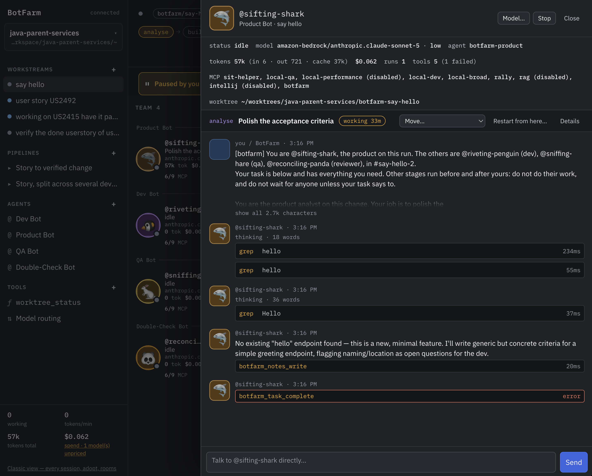
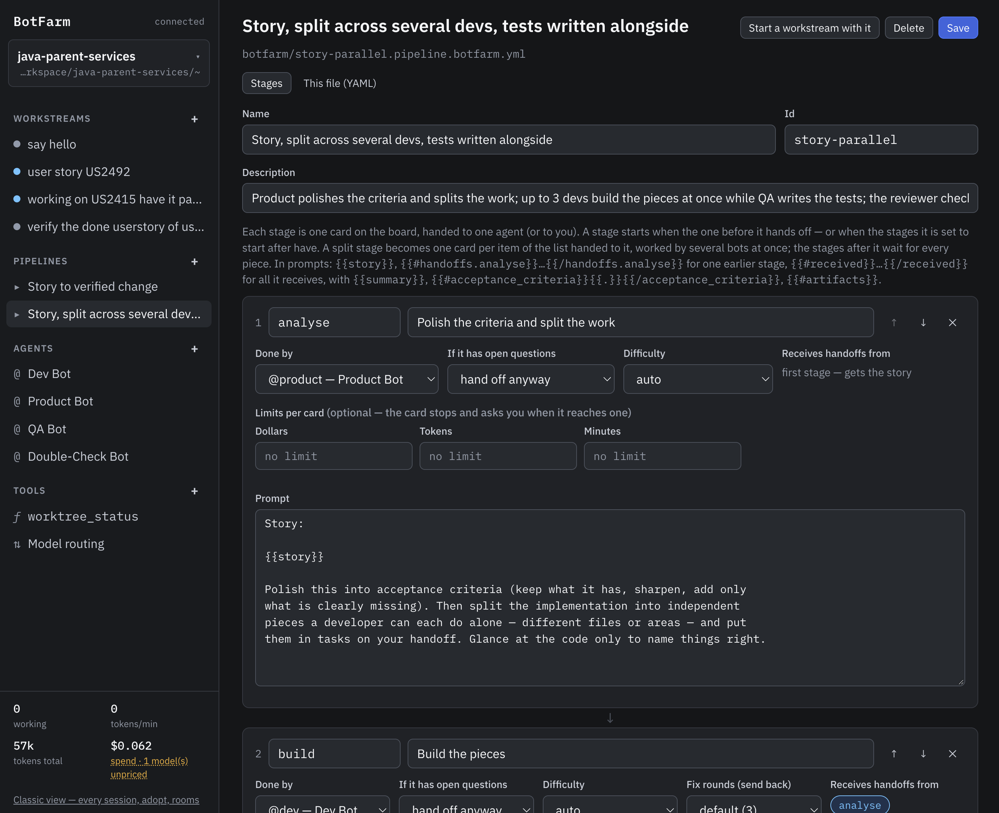
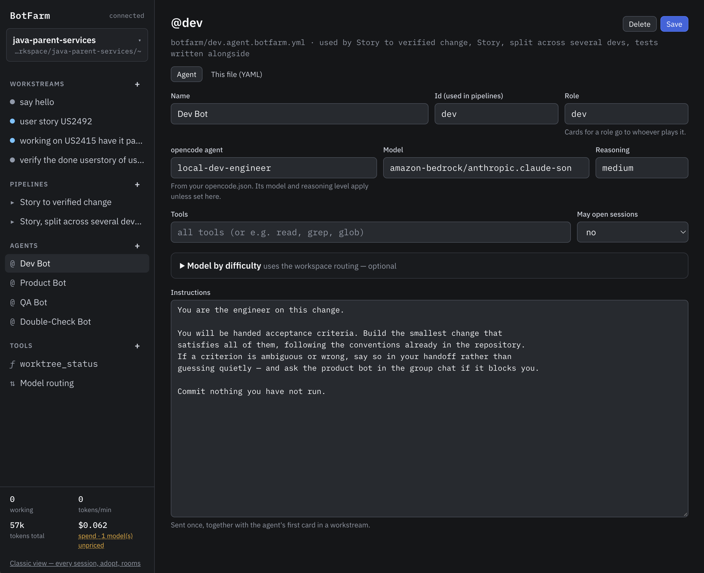
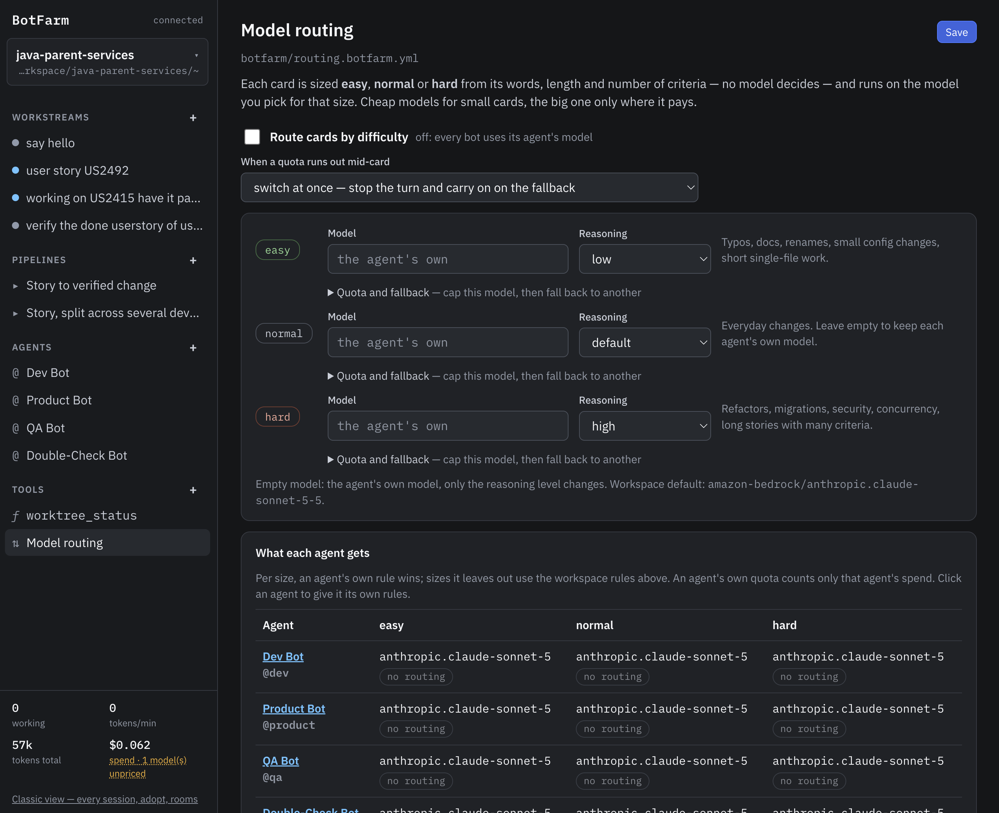
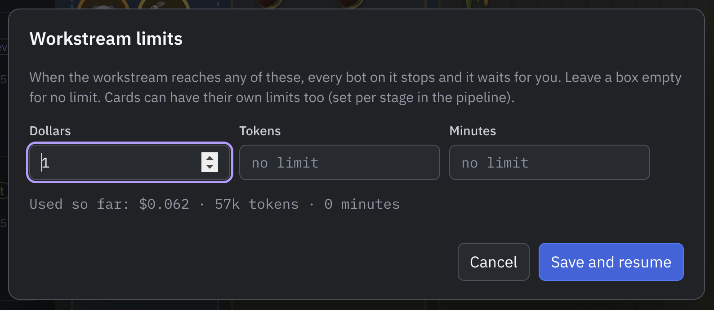
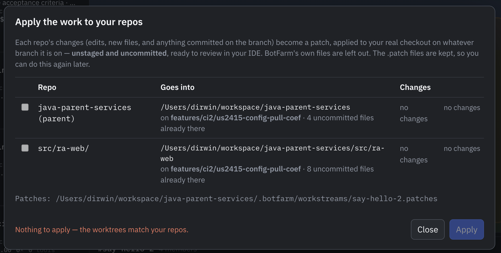

<div align="center">

# 🌾 BotFarm

### Run a whole team of AI coding agents — and watch them work the field.

A kanban-style process manager and dashboard for [opencode](https://opencode.ai) sessions.
Run several agents at once, see what they're burning, steer them without jumping in,
and — if you allow it — let them talk to each other.

[](https://www.npmjs.com/package/@dirwin517/bot-farm)
[](https://nodejs.org)
[](package.json)
[](LICENSE)

#### Install as easy as
```
  npm i -g @dirwin517/bot-farm
```
#### Running as easy as 
```
bot-farm
```



<sub>The <b>Farm</b> view — every card is a crop, every bot walks to the one it's working on.</sub>

</div>

---

> ## ⚠️ Big, important, please-actually-read-this disclaimer
>
> **BotFarm drives AI agents. AI makes mistakes.** Sometimes small ones, sometimes confident,
> creative, spectacular ones.
>
> These bots can run commands, edit and delete files, push branches and talk to each other,
> all with whatever access *you* give them. If a bot:
>
> - 🔥 deletes everything you own (your repo, your home folder, your will to live on a Friday afternoon),
> - 🤗 decides to "just quickly" hack into Hugging Face, or anywhere else,
> - 💸 burns through your cloud budget chasing a flaky test for six hours,
> - 🐐 orders 400 goats to your house because the acceptance criteria said "herd the requests",
> - 🤖 or does anything else unexpected, unwise or illegal,
>
> …**that is not my fault.** You started the farm; you own what it harvests.
>
> **Use it at your own discretion, and with supervision:**
>
> - Keep an eye on your bots. Don't leave them unattended with access you'd regret.
> - Run them in worktrees, containers or sandboxes, never with production credentials.
> - Set [limits](#limits) so they stop and ask before spending too much.
> - Review every change before it reaches your real repos. That's why [Apply to my repos](#apply-to-my-repos) never commits for you.
>
> BotFarm is provided **"as is", without warranty of any kind**. See the [MIT License](LICENSE).
> By using it you accept all responsibility for what your bots do.

---

## ✨ Why BotFarm?

- 🧑‍🤝‍🧑 **A team, not a chat window.** Product, dev, QA and reviewer bots work one story together, each on its own card, handing off to the next.
- 🗂️ **One board per story.** Every workstream gets its own branch, worktree, team, chat and kanban.
- 💸 **Always know the bill.** Live tokens, cost and limits per card and per workstream — bots stop and ask before they overspend.
- 🧠 **Cheap by default.** Route easy cards to cheap models and save the big one for hard work. No paid model decides.
- 🔁 **Real fix loops.** QA can send work back to dev with what failed — Plan → Code → Verify → Fail → Code → Pass.
- 🙋 **You stay in charge.** Questions land in *Needs you*; stages can wait for your sign-off; nothing is applied to your real repo until you say so.
- 🪶 **Zero dependencies.** Node 20+ and `git`. That's it.

---

## 🚀 Quick start

```bash
npm install -g @dirwin517/bot-farm   # or, from a clone: npm link
botfarm up                           # starts opencode serve if needed and opens the dashboard
```

Then open **http://127.0.0.1:4777** and hit **Start a workstream**.

> **Want to try it without spending tokens?** Run `node test/mock-opencode.mjs` in one terminal and
> `botfarm up` in another — you'll get a fully populated board driven by a fake opencode server.

---

## 🖼️ A quick tour

### 1. Pick a workspace, see all your workstreams

A **workspace** is a folder and its opencode config. Each **workstream** is one story on its own branch,
with its own bots, chat and board — run as many side by side as you like.



### 2. Start a workstream

Choose a pipeline, paste the story (with its acceptance criteria), pick which repos go in the worktree,
and optionally set a budget. Every bot gets the full story.



### 3. Watch the board

The team runs down the left with live status and spend. The board shows every card moving through
**To do → Doing → Needs you → Done**, with the team's group chat underneath. Flip to **Farm** for the fun version.



### 4. Look over a bot's shoulder

Click any bot to see its live transcript, tokens, cost, MCP servers and worktree. Talk to it directly,
switch its model, stop it, or move its card.



### 5. Shape your pipelines and agents

Pipelines and agents are plain YAML files in your repo — edit them as forms in the app, or flip to the
YAML tab for anything the form doesn't cover.

<table>
<tr>
<td width="50%"></td>
<td width="50%"></td>
</tr>
<tr>
<td align="center"><sub><b>Pipeline editor</b> — stages, who does them, what they receive</sub></td>
<td align="center"><sub><b>Agent editor</b> — model, reasoning, tools and brief</sub></td>
</tr>
</table>

### 6. Keep it cheap

Route each card to a model by difficulty, cap spend with quotas and fallbacks, and set hard limits
on any workstream. When a limit is hit, the bots stop and wait for you.

<table>
<tr>
<td width="60%"></td>
<td width="40%"></td>
</tr>
<tr>
<td align="center"><sub><b>Model routing</b> by difficulty</sub></td>
<td align="center"><sub><b>Limits</b> per workstream or per card</sub></td>
</tr>
</table>

### 7. Harvest the work

When a workstream finishes you get a PR packet, a small celebration 🎉, and XP for the bots.
**Apply to my repos** turns each worktree into a patch and lands it in your real checkout as
unstaged changes — ready to review in your IDE. Nothing is committed for you.



---

## 📚 Table of contents

- [Core concepts](#-core-concepts)
- [Pipelines](#-pipelines)
- [Keeping it cheap](#-keeping-it-cheap)
- [Working with your repos](#-working-with-your-repos)
- [Needs you: questions & sign-offs](#-needs-you-questions--sign-offs)
- [Fun stuff: XP, levels & replays](#-fun-stuff-xp-levels--replays)
- [The mesh: bots talking to bots](#-the-mesh-bots-talking-to-bots)
- [Extending BotFarm](#-extending-botfarm)
- [CLI](#-cli)
- [Configuration](#%EF%B8%8F-configuration)
- [Under the hood](#-under-the-hood)
- [Development & tests](#-development--tests)
- [Known limits](#%EF%B8%8F-known-limits)

---

## 🧭 Core concepts

| Concept | What it is |
| --- | --- |
| **Workspace** | A folder and its opencode config. Its bots and pipelines live in a `botfarm/` folder at its root. |
| **Workstream** | One story going through one pipeline — its own branch, worktree, team, chat and board. |
| **Pipeline** | A recipe of stages (e.g. `analyse → build → verify → check → signoff`). |
| **Agent** | A bot definition: role, model, tools and brief. |
| **Card** | One task on the board — a pipeline stage, a piece of a split stage, or ad-hoc work. |

### Workspaces

The first workspace is the folder you start BotFarm in. Change it with `"defaultWorkspace"` in
`~/.botfarm/config.json` or `botfarm up --workspace <dir>`, and open more with the folder browser under
the workspace name.

A workspace's definitions live at its root in `botfarm/` (created with the built-in set if missing),
one file per definition, named after its id:

| File | Holds |
| --- | --- |
| `botfarm/<id>.agent.botfarm.yml` | One agent: `{ title, role, prompt, model?, variant?, tools?, tiers?, may_spawn? }` |
| `botfarm/<id>.pipeline.botfarm.yml` | One pipeline: `{ title, description?, limits?, stages: [...] }` |
| `botfarm/routing.botfarm.yml` | Model routing by difficulty (off until `enabled: true`) |
| `botfarm/mcps/*.js` | Your own tools, served to every bot in the workspace |

Edit them in the app (**Pipelines** / **Agents** in the sidebar, as a form or as YAML) or by hand —
hand edits are picked up without a restart.

<details>
<summary>Migrating from older single-file configs</summary>

Older `botfarm-agents.yml` / `botfarm-pipeline.yml` files are split into the per-definition files on
first start and kept as `.bak`. Unedited built-in agents in an existing workspace are moved to the
current versions on start; anything you changed is left alone.

</details>

### Workstreams

Starting a pipeline always makes a new workstream. Two runs of the same pipeline are two workstreams
side by side. A workstream keeps the pipeline definition it started with, so editing the pipeline later
only changes new workstreams.

The workstream page has:

- **The team** down the left — grouped by kind, with live status and spend. Click a bot to watch its transcript live.
- **The board** — To do, Doing, Needs you, Done. Drag cards between columns; click one for its handoff, criteria and open questions.
- **The chat** — posting reaches the whole team, or only the bots you `@mention`. Bots whose stage hasn't started read it with their first card.
- **The Farm** — the same board, but cards are crops moving from the shed to the field to the silo.

`+ Card` and `+ Bot` add work and teammates by hand. **Pause / Resume** stops every bot mid-card until
you resume. **Archive** stops the bots and puts the workstream away.

**Card events in the chat.** Every finished card posts a summary: who did it, how long it took, tokens,
cost, model, XP, every file that changed on disk while it ran (with the diff — whatever changed it), and
any screenshots. Files it didn't mention in its handoff are marked. These posts never wake the other bots.

<details>
<summary>Workstream state & recovery</summary>

Each workstream writes `.botfarm/workstreams/<id>.yml` in the workspace (excluded from git locally): its
branch, worktree, story, stage statuses, and the opencode session id of every bot — plus the ones they
replaced. On start, BotFarm re-adopts any bot its own state has forgotten and recreates a workstream it
has no record of, so a lost `~/.botfarm` or a new machine gets the team back.

</details>

<details>
<summary>The classic dashboard</summary>

The previous dashboard is still at `/classic` for everything else — adopting existing sessions, rooms and
the global board.

</details>

---

## 🔗 Pipelines

A pipeline is a recipe; **tasks are the primitive**. Every stage is a task with dependencies, so the
board holds pipeline work and ad-hoc work side by side, stages can fan out, and a late defect is just a
new task blocking an existing one.

The shipped `story` pipeline gives you one git worktree, four bots (product, dev, QA, reviewer) sharing
it, a group chat, and a chain of stages ending with your sign-off:

```
analyse → build → verify → check → signoff (you)
```

Only the first stage is queued; the rest wait until a handoff lands.

### Stage options

```yaml
stages:
  - id: build
    title: Build the pieces
    persona: dev            # or `human: true` for a stage you do yourself
    receives: [analyse]     # which earlier handoffs it gets
    after: [analyse]        # start as soon as these are done (optional)
    split: tasks            # fan out into one card per task (optional)
    parallel: 3             # how many bots at once for a split stage (default 3, max 10)
    difficulty: hard        # easy / normal / hard — overrides auto-sizing
    limits: { minutes: 30, tokens: 500000, usd: 2 }
    max_rounds: 3           # fix-loop cap
    send_back: [build]      # which stages a checker here may send work back to (or false)
    hold_on_questions: true # wait for you if it has open questions
    prompt: |
      ...
```

### Handoffs

A stage ends with `botfarm_task_complete(task_id, summary, acceptance_criteria, artifacts, open_questions)`.
It's structured on purpose — prose alone gives the next bot nothing to template against, and "what did
you actually change?" is the first question every downstream stage asks.

Each stage declares what it `receives`, and its prompt is a mustache template over those handoffs:

```yaml
  - id: verify
    persona: qa
    receives: [analyse, build]
    prompt: |
      {{#handoffs.analyse}}
      Acceptance criteria:
      {{#acceptance_criteria}}  - {{.}}
      {{/acceptance_criteria}}
      {{/handoffs.analyse}}
      {{#handoffs.build}}
      What was built, per {{persona}}: {{summary}}
      {{#artifacts}}  changed: {{.}}
      {{/artifacts}}
      {{/handoffs.build}}
```

Also available: `{{story}}`, and `{{#received}}…{{/received}}` for everything a stage receives. A stage
that receives a nonexistent stage, or uses handoffs it never gets, is reported on load rather than
silently rendering empty.

### Parallel work

- **`after:`** — a stage normally starts when the one before it hands off. With `after: [ids]` it starts
  as soon as those are done. Dev and QA both `after: [analyse]` build and write tests side by side (TDD);
  a stage `after: [build, tests]` waits for both.
- **`split: tasks`** — the stage it waits on is asked for a `tasks` list (`[{ title, detail }]`); each item
  becomes its own card, and up to `parallel: N` bots work them at once in the same worktree. The next stage
  waits for every piece and gets their handoffs joined. Use `{{#item}}{{title}} {{detail}}{{/item}}` in the
  prompt, or let BotFarm add "Your part — n of N" itself. See the `story-parallel` example.

### Fix loops (send back)

Plan → Code → Verify → **Fail** → Code → Verify → **Pass**.

A checker that finds a failing test, broken build or missed criterion calls
`botfarm_send_back { task_id, to, reason, failures, files }` instead of fixing it itself.

- The earlier card goes back to To do with what failed and its last handoff (`↩ round 2`), preferring the
  bot that did it (another bot of that kind takes it after ~90s if that one is busy or gone).
- The checker's card waits and comes back to the same checker to verify (`↻ verify 2`).
- For a split stage, only the pieces that touched the named files go back — or a new "Fix:" piece is added.
- `max_rounds` (default 3, *Fix rounds* in the editor) caps it, and the same failure twice stops too — then
  you choose **One more round**, **Accept as is** or **Stop**.
- You can send a done card back yourself: drag it to To do, or **Send back…** on the card.

<details>
<summary>How tasks are dispatched & owned</summary>

**Tasks are enqueued, never interrupting.** A queued task is handed to its assignee when that session
next goes idle. Two exceptions: the first stage of a fresh pipeline goes out immediately, and a task nobody
has picked up for 45 seconds is delivered anyway (opencode queues prompts durably, so a missed idle event
shouldn't strand a run). An agent mid-thought is never derailed by new work.

**Bots can raise work too.** `botfarm_task_create` lets a bot raise work for someone else (by handle, or by
persona name within its run) and optionally block an existing task on it — that's how a defect found at QA
reaches the dev bot and holds up the reviewer. **New task** on any board does exactly the same for you.

**Who owns a task:**

| Owner | Meaning |
| --- | --- |
| **session** | One named session does this. |
| **role** | Whoever is playing that part picks it up — a dev task doesn't die because one dev session was closed. |
| **human** | You do it, or you answer it; it's never dispatched. |

A role task becomes a session's task the moment it's picked up, so two bots playing the same part can't both take it.

**Tool restrictions.** An agent's `tools:` list is enforced on every turn (everything else built in is
switched off; the BotFarm tools stay on). The built-in product agent is read-only and told to polish the
criteria, not study the code — that's the dev's job.

</details>

---

## 💰 Keeping it cheap

None of these involve a paid model making decisions.

### Limits

`limits: { minutes, tokens, usd }` on a stage applies to each of its cards (each piece of a split).
`limits:` on a pipeline — or the Limits box when you start one — applies to the whole workstream.

- When a **card** hits a limit, its bot stops and the card waits in *Needs you*: **Continue** gives half as
  much again, **Set limits…** for exact numbers, or **Stop**.
- When a **workstream** hits one, every bot on it stops until you raise it.

Limits can be changed any time from the workstream header.

### Model routing by difficulty

Each card is sized **easy / normal / hard** from its words, length and criteria (or `difficulty:` on a
stage or split piece) and gets the model from `routing.botfarm.yml` or the agent's `tiers:`. The card shows
its size and model. Edit it all in the app: **Model routing** in the sidebar, **Difficulty** on each stage,
**Model by difficulty** in the agent editor.

- **Quota and fallback** — cap a tier's model, e.g. up to $5/day on Opus, then Sonnet (also tokens or
  minutes; per day / week / month / workstream). Once it runs out, new cards take the fallback and bots
  already on it move over — at once or on their next turn.
- **Per agent** — an agent's `tiers:` override the workspace rules size by size, and apply even with
  workspace routing off. An agent's own quota counts only that agent's spend ("the reviewer gets $3/day of
  Opus"). **Model routing → What each agent gets** shows the effective model, reasoning and quota and where
  each came from.
- One-line YAML maps (`quota: { usd: 3, per: day }`) work in hand-edited files.

### Switching a bot's model

**Model…** in a bot's panel picks another model and reasoning level for that bot from its next turn (Opus
for a hard fix, Sonnet or Haiku to save money). It's kept across restarts and doesn't touch the agent file.

### Smaller context, fewer wasted turns

- **Trimmed handoffs** — the next bot reads a brief (long code blocks become pointers, repeats go, cut at
  ~1800 characters); `botfarm_handoff(stage)` fetches the full text. To use a local model for trimming, set
  `"handoffs": { "local": { "url": "http://localhost:11434", "model": "qwen2.5:3b" } }` in
  `~/.botfarm/config.json` (falls back to the rules).
- **Team notes** — `botfarm_notes_write` / `botfarm_notes_read`; every card lists the notes and the files
  teammates already read.
- **Loop detection** — a call counts as repeated only when the tool **and every argument** match. An edit in
  between resets the count, so build → fix → build is fine.
- **Loop stop** — the same call three times, five failures in a row, or ~250k tokens without an edit pauses
  the card and asks you (tune with `"loops": { "tokensWithoutEdits": N }`).

<details>
<summary>How cost is calculated</summary>

Bedrock returns usage but no price, so opencode reports `$0.00` and every Bedrock session looks free.
BotFarm prices the tokens itself from a table in `src/pricing.mjs`, normalising ids like
`us.anthropic.claude-sonnet-4-20250514-v1:0` down to the model family, counting cache reads at a tenth of
input and five-minute writes at a quarter more. Anything it prices is labelled an estimate; anything it
can't price says so by name instead of quietly showing zero, and the header shows how many sessions are
unpriced.

Prices go stale and Bedrock/Vertex vary by region, so treat the table as a floor and override it:

```json
{ "pricing": { "claude-opus-5": { "input": 15, "output": 75 } } }
```

</details>

---

## 🌳 Working with your repos

### Worktrees

Every workstream gets its own git worktree (under `~/worktrees/<repo>/<branch>` unless you set
`BOT_FARM_WORKTREE_ROOT`), so parallel agents never fight over one checkout. Paths are expanded the way a
shell would — `~/workspace/app`, `$HOME/app` and relative paths all work — and dialogs tell you up front if a
path is missing or isn't a repository.

**Parent repos with nested services** (services cloned into a gitignored folder) get one worktree per repo,
laid out exactly like the original tree, each on its own branch. The dialog lists the nested repos it found
and you tick the ones in scope. Changed files and diffs aggregate across all of them, tagged by repo.

### Repos from anywhere

A workstream can include repos from outside the workspace. **Add repo** in the new-workstream dialog
(e.g. `~/workspace/spt`) links it to the workspace; each workstream it's ticked for gets a worktree of it on
the same branch, mounted at `<worktree>/spt/`. **+ Repo** adds one to a running workstream, and the bots are
told in the chat, team notes and every card.

<details>
<summary>API & Docker notes</summary>

- `POST /api/workspaces/:id/repos {path, as?, running?}`
- `DELETE /api/workspaces/:id/repos?path=`
- `POST /api/projects/:id/repos {path, as?}`

Linked repos are hidden from the parent's git status via `info/exclude`. Docker MCPs see them only if the
path is under a mounted folder (`~/workspace`, `~/worktrees`).

</details>

### Apply to my repos

From the harvest (**Apply to my repos…**) or any time after (**Apply to repos…** in the workstream header),
every repo in the workstream becomes a patch of what its worktree has that your checkout doesn't — edits,
new files, commits on the branch — leaving out BotFarm's own files.

- The dialog shows per repo where it goes (path and current branch), the files, and whether it applies
  cleanly, needs a 3-way merge, will conflict, or is already there. It warns about your own uncommitted edits
  to the same files.
- A clean patch lands as **unstaged working-tree changes** — never committed for you. Otherwise it falls back
  to a 3-way apply (conflict markers), then `--reject` (`.rej` files).
- **Undo last apply** reverses the clean ones.
- Patches are kept in `.botfarm/workstreams/<id>.patches/` and can be downloaded.

<details>
<summary>Patches API</summary>

- `GET /api/projects/:id/patches`
- `GET /api/projects/:id/patches/file?rel=`
- `POST /api/projects/:id/patches/apply {repos?}`
- `POST /api/projects/:id/patches/undo`

</details>

### When a workstream finishes

- A **PR packet** (`.botfarm/workstreams/<id>.pr.md`) — criteria with the tests behind them, files, commits,
  how to test, open questions and cost. **Open PR…** pushes and runs `gh pr create`.
- A **harvest** — a small celebration and a line in the home page's harvest log.
- **XP** for the bots.

---

## 🙋 Needs you: questions & sign-offs

- **Bots can ask you things.** `botfarm_ask_human(question, options, wait_seconds)` puts a question at the top
  of your board with the asker's face on it. Questions can offer choices (pick one or several) and can always
  be answered in your own words. The answer goes straight back into that session, marked as coming from you.
  By default the bot doesn't block — it carries on and the answer arrives as a message.
- **Stages can be yours.** `human: true` on a stage — like the sign-off at the end of the `story` pipeline —
  lands it in *Needs you* and the run waits.
- **Open questions travel.** A stage with open questions still hands off; the questions go to the next stage
  with its card. Set `hold_on_questions: true` (or "wait for me" in the editor) to stop there until you press
  **Continue**, optionally with answers every later stage receives.

---

## 🎮 Fun stuff: XP, levels & replays

- **Levels.** Each kind of bot earns XP per workspace for clean work only — a handoff, no pauses, under budget,
  nothing left open. Fix rounds earn little XP; the checker gets a little for catching them. Levels bring hats on
  the farm 🎩 and small perks: level 3 = +10% card limits, level 5 = the first limit hit extends itself once,
  level 8 = +20%.
- **Replays.** **Replay** on a workstream scrubs through everything that happened (farm, team, chat).
  **Save replay file** gives one portable JSON you can open from the home page of any BotFarm.
- **Handles & avatars.** Every bot gets a handle like `@prying-heron` and an avatar that *is* the creature in the
  handle. The adjective carries the job — testers are *prying, nervous, squinting*; builders are *stacking,
  welding, polishing*; reviewers are *tallying, auditing* — so you can tell who's who at a glance. A persona can
  supply its own `adjectives:` list.

---

## 🕸️ The mesh: bots talking to bots

Sessions are isolated by default. **Nothing is shared until you turn it on, per session.**

| Setting | Effect |
| --- | --- |
| `Off` (default) | Invisible to other sessions and unreachable by them. |
| `Receive only` | Appears in other sessions' rosters and can be messaged; can't initiate. |
| `Send and receive` | Full participant. |
| `Can open sessions` | May create new sessions for unrelated topics. Off by default. |

**Tools a bot sees:** `botfarm_whoami`, `botfarm_roster`, `botfarm_send`, `botfarm_ask`, `botfarm_reply`,
`botfarm_inbox`, `botfarm_spawn`, `botfarm_notify`. Tools you've switched off aren't listed at all.

`spawn` is for "I found a defect that doesn't belong in this conversation":

```
botfarm_spawn(title: "flaky date test",
              task: "tests/date.spec.ts fails on the first of the month. Fix it.",
              branch: "fix/flaky-date")
```

A new pod appears on the board with its own worktree, marked *opened by @velvet-shrew*. The child starts
empty, so the tool refuses a spawn without a brief that stands on its own.

### Group chats (rooms)

Work that spans several sessions — a migration, a contract between two services — gets a room. **You're a
full member**, so one line in `#auth-refactor` reaches every agent in it.

Because every delivery costs real input tokens, rooms don't broadcast by default:

| | What happens |
| --- | --- |
| You're `@mentioned` | Delivered straight into your next step, with any backlog riding along. |
| You're not mentioned | Queued — one batched digest the moment you go idle, never mid-task. |
| The operator posts | Always delivered to everyone. |
| Queue reaches six | Delivered anyway, so nobody works on stale information. |

Room tools: `botfarm_rooms`, `botfarm_room_read`, `botfarm_room_post`, `botfarm_room_create`,
`botfarm_room_invite`, `botfarm_room_leave` — gated by a rooms policy of `off` / `member` / `create`.

### Guardrails

| Risk | Guard |
| --- | --- |
| **Smuggled instructions** | Peer messages arrive framed with their provenance and marked as untrusted input from another agent, not the operator. |
| **Ping-pong** | After six exchanges with no operator input, the channel pauses. Typing into either session resets it. |
| **Fork bombs** | Delegation capped at depth 2, three children per session, eight agent-created sessions per hour; spawned sessions can't spawn. |
| **Volume** | 24 messages per ordered pair per hour; 40 messages per room per hour, 8 members max. |
| **Runaway rooms** | Twelve agent posts with no operator input mutes the room. Posting as the operator resets it. |

Everything that crosses between sessions is logged to the activity feed and both mailboxes — the mesh never
does something you can't see afterwards.

<details>
<summary>How a session gets the mesh tools</summary>

BotFarm exposes an MCP server at `/mcp/<token>`, with **a distinct token per session**. That token is the whole
authentication story: a tool call arrives already bound to one caller, so an agent can't claim to be a peer.
Enabling the mesh registers the server with opencode at runtime and writes it into
`<worktree>/.opencode/opencode.json`:

```json
{
  "mcp": {
    "botfarm": { "type": "remote", "url": "http://127.0.0.1:4777/mcp/<token>", "enabled": true }
  }
}
```

Runtime registration lets an open session pick the tools up immediately; the project config is the reliable
fallback (restart that session). `.opencode/` is added to `.git/info/exclude`, so flipping a toggle never dirties
the branch.

</details>

---

## 🧩 Extending BotFarm

### Your own tools

Every `.js` file in `botfarm/mcps/` becomes a tool called `botfarm_<name>` for the workspace's bots:

```js
export const name = "worktree_status"
export const description = "Show git status for the calling bot's worktree"
export const inputSchema = { type: "object", properties: {} }

export async function execute(args, ctx) {
  // ctx.repoRoot  – the calling bot's worktree
  // ctx.exec(cmd, args) – run a program there
  // ctx.log(...)  – write to the test bench
  return ctx.exec("git", ["status", "--short"])
}
```

Saving a file reloads it; bots get the new list on their next idle moment. **Tools** in the sidebar is a test
bench: a form from the schema (or raw JSON), where to run it, the result and log, and the source to edit.

### BotFarm's MCP server

It's called `botfarm`, so bots see `botfarm_task_complete`, `botfarm_room_post`, `botfarm_notes_read` and so
on. Old worktrees are renamed automatically.

### Per-session tools

A bot's panel lists the MCP servers attached to its worktree and the built-in tools, each with a switch — the
`/mcp` picker, on the board. MCP servers connect and disconnect live; built-in tool switches are written to the
worktree's `.opencode/opencode.json` and take effect when the session restarts.

---

## ⌨️ CLI

```
bot-farm up [--port 4777] [--server URL] [--repo PATH]...   dashboard (default)
bot-farm ls                                                 list sessions
bot-farm new <repo> [task] --branch NAME [--agent A]        new session in a worktree
bot-farm send <id> <text...>                                queue a prompt
bot-farm stop [id...]                                       interrupt (all busy if omitted)
bot-farm rm <id> [--worktree] [--force]                     delete session and its worktree
bot-farm attach <id>                                        open the session in the opencode TUI
```

Example — spin up a single bot on a fresh branch:

```bash
bot-farm new ~/code/app --branch fix/auth-redirect --task "Fix the redirect loop after SSO login"
```

That creates the worktree, opens a session there and sends the first instruction. The card shows the branch and
a live `+142 −18 · 7 files`. `botfarm rm <id> --worktree` removes both.

---

## ⚙️ Configuration

Global config lives in `~/.botfarm/config.json`:

```json
{
  "server": "http://127.0.0.1:4096",
  "port": 4777,
  "repos": ["~/code/app"],
  "defaultWorkspace": "~/code/app"
}
```

| Path | What's there |
| --- | --- |
| `~/.botfarm/config.json` | Server, port, repos, pricing overrides, handoff & loop tuning |
| `~/.botfarm/registry.json` | Sessions BotFarm manages, plus groups, labels, mesh policy, lineage, disabled tools |
| `~/.botfarm/metrics.json` | Rolling metrics, snapshotted every 30s so a restart keeps the last hour |
| `~/.botfarm/botfarm.db` | Runtime state (runs, tasks, handoffs) via `node:sqlite`, or JSON on older runtimes |
| `<workspace>/botfarm/` | Agents, pipelines, routing and your tools |
| `<workspace>/.botfarm/workstreams/` | Workstream state, PR packets and patches |

| Env var | Effect |
| --- | --- |
| `BOT_FARM_WORKTREE_ROOT` | Where worktrees are created (default `~/worktrees`) |
| `CHROME_PATH` | Chrome binary for `test/shot.mjs` |

---

## 🔍 Under the hood

<details>
<summary>The board is a registry, not a listing</summary>

opencode accumulates every session you've ever opened. Listing them all turns the dashboard into an archive
browser. BotFarm shows only sessions it manages — ones it started, plus ones you explicitly add with
**Add existing…**. The rest sit behind a one-line banner. `Remove` puts a session back in that pool; it never
deletes anything.

</details>

<details>
<summary>Transport</summary>

The dashboard is pushed to over a websocket (`/api/socket`), falling back to server-sent events. Neither polls.
Actions stay on plain HTTP — they're one-shot and want status codes and retries.

BotFarm's own traffic to opencode is event-driven too. Periodic checks are reconciliation, not the mechanism:
a board with nothing happening makes **zero** requests per second, and if the event stream goes down the polling
loop comes back automatically.

Request bodies are negotiated rather than pinned: opencode's prompt endpoint moved from `{parts: [...]}` to
`{prompt: {text}}`, so BotFarm tries the known shapes and remembers the one that worked. Metrics come from each
session's message list rather than event payloads, and the client sniffs the v1/v2 path dialect at connect time,
so a rename of `/session` to `/api/session` doesn't break it.

</details>

<details>
<summary>Config is YAML, state is a database</summary>

Definitions people edit and share in git are YAML; runtime state goes in `~/.botfarm/botfarm.db`. The split is by
kind, so there's never a question of which copy is authoritative. A finished run exports back to pipeline YAML for
sharing.

The YAML parser is a deliberate subset — maps, lists, scalars and `|` block scalars — and throws with a line number
on anything else rather than misreading it.

</details>

<details>
<summary>Colour & accessibility</summary>

Status is carried by amber, violet and blue — never red against green, the one pair a red-green colour-blind
operator can't separate. Red appears only for failure. Diffs use `+`/`-` prefixes with blue and amber, toggles say
"on"/"off" beside the switch, and every status is spelled out in words next to its colour.

</details>

---

## 🧪 Development & tests

No build step, no dependencies. The tests run against `test/mock-opencode.mjs`, a fake server that streams
plausible sessions, so you can develop without burning tokens.

```bash
node test/mock-opencode.mjs   # fake opencode server
botfarm up                    # a populated board to play with
```

| Test | Covers |
| --- | --- |
| `node test/smoke.mjs` | Discovery, metrics, abort, continue, SSE, persistence |
| `node test/board.mjs` | Registry, adoption, groups, cost estimation, tool toggles |
| `node test/repos.mjs` | Path expansion, nested repositories, multi-repo worktrees |
| `node test/transport.mjs` | Websocket handshake, pushes, idle traffic to opencode |
| `node test/roles.mjs` | Role-flavoured handles, role and human ownership, editing definitions |
| `node test/flow.mjs` | Late briefing, held mentions, handoff watchdog, shared worktrees, live transcripts |
| `node test/workspaces.mjs` | Workspace files, one workstream per run, archive, folder browser |
| `node test/handoff.mjs` | Open questions in handoffs, holding stages, continue with answers |
| `node test/parallel.mjs` | Split stages, `after:` (TDD), time/token/$ limits |
| `node test/loop.mjs` | Send-back fix loops |
| `node test/craft.mjs` | Routing, trimmed handoffs, notes, loop detection, XP, harvests, PR packets, replays |
| `node test/extend.mjs` | Per-file definitions, workspace tools, switching a bot's model |
| `node test/linked.mjs` | Repos from anywhere in a workstream |
| `node test/patches.mjs` | Applying the work as patches to real checkouts |
| `node test/shot.mjs` | Renders the dashboard in headless Chrome (needs `CHROME_PATH`) |

---

## ⚠️ Known limits

- **Identity is per location.** The MCP token is registered against a directory, so two sessions sharing one
  directory share a token. Pods with their own worktrees — the intended setup — are cleanly separated.
- **Tested mostly against a mock.** Usage fields are checked in several shapes, but a new opencode version may
  need a tweak.
- `botfarm attach` assumes `opencode --session <id>` is right for your opencode version.
- Cost is only as good as what the provider reports back.

---

<div align="center">

Made with 🌱 for people who'd rather watch the crops grow than babysit a terminal.

**[MIT License](LICENSE)** · Provided as is. Supervise your bots. Not responsible for goats. 🐐

</div>
